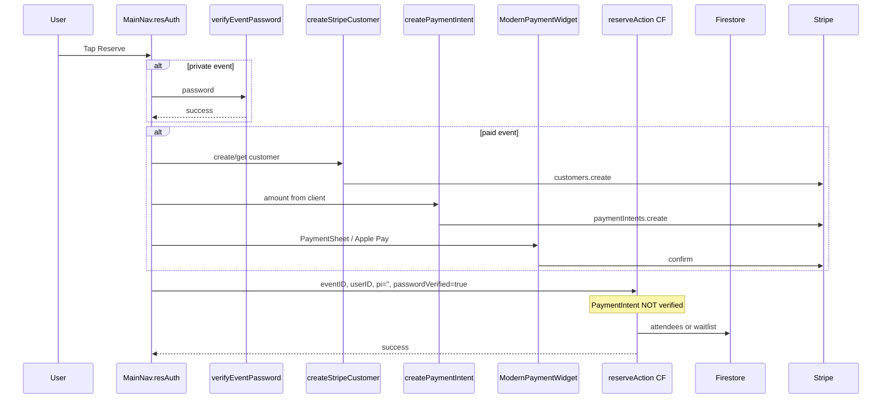

# OpenSlot — Full Project Analysis

**Date:** 2026-08-11  
**App:** OpenSlot (package `slotted`) v1.0.97+133  
**Firebase project:** `open-mic-5cc8e`  
**Scope:** Security audit · Payment/reservation flow · Refactor plan · Run-in-this-environment

---

## Executive summary

OpenSlot is a **feature-rich Flutter marketplace** for open-mic / open-deck events (discover → reserve → live host → chat → payouts), backed by Firebase + Stripe Cloud Functions.

| Area | Verdict |
|------|---------|
| Product completeness | High — core loops are built |
| Architecture / maintainability | Weak — 5 god files (~16k LOC) |
| Security | **Not production-safe** — Critical issues |
| Payments | Works client-side, **not server-enforced** |
| Run here | Possible via **web** after installing Flutter; no Android SDK/iOS |

**Do not ship as-is.** Fix Critical security items before any App Store / production push.

---

# 1. Security audit

## Severity counts

| Severity | Count |
|----------|------:|
| Critical | 9 |
| High | 8 |
| Medium | 9 |
| Low | 6 |

## Critical findings

### C1 — `deleteEvent` is unauthenticated
- **Where:** `functions/src/index.ts` (~582–675), called from `lib/pages/main_nav.dart`
- **Risk:** Anyone who can POST `{ eventID }` can delete any event and clean attendee/host arrays.
- **Fix:** Require Firebase Auth; only host or admin. Prefer callable + drop open HTTP.

### C2 — Admin checks disabled on moderation APIs
- **Where:** `reviewReport`, `getPendingReports`, `getReviewedReports` — comments say `TEMPORARY: Disable admin check for testing`
- **Risk:** Any signed-in user can list reports, remove content, suspend users.
- **Fix:** Re-enable admin doc / custom claims check immediately.

### C3 — `reserveAction` trusts client identity
- **Where:** `functions/src/index.ts` (~102–350)
- **Risk:** No auth. Body `userID` and `passwordVerified: 'true'` are trusted → reserve/unreserve as anyone; bypass private events. No PaymentIntent verification for paid seats.
- **Fix:** Callable with `context.auth.uid`; server password token; verify PI before seating; use transactions.

### C4 — `getEphemeralKey` Stripe customer IDOR
- **Where:** `functions/src/index.ts` (~476–520)
- **Risk:** Anyone with a `cus_` ID (readable from user docs) can get an ephemeral key for that customer.
- **Fix:** Auth required; resolve customer from UID server-side only.

### C5 — `createStripeCustomer` can overwrite any user
- **Where:** `functions/src/index.ts` (~1203–1313)
- **Risk:** Unauthenticated body `userId` overwrites that user’s Stripe customer ID.
- **Fix:** Callable; only update `context.auth.uid`.

### C6 — `createPaymentIntent` unauthenticated arbitrary amounts
- **Where:** `functions/src/index.ts` (~522–579)
- **Risk:** Client chooses amount/currency/customer → card testing, wrong-amount fraud.
- **Fix:** Auth; derive amount from event doc; bind customer to caller.

### C7 — Event passwords logged in plaintext
- **Where:** `verifyEventPassword` failure path logs `storedPassword` / `receivedPassword`
- **Fix:** Never log secrets; store hashes (bcrypt/argon2); rate-limit.

### C8 — `reportStripeUsage` open billing meter
- **Where:** `functions/src/index.ts` (~1116–1200)
- **Risk:** Unauthenticated POSTs can inflate usage meters → financial damage.
- **Fix:** Internal-only from verified reservation success; idempotency keys.

### C9 — Event passwords world-readable in Firestore
- **Where:** `firestore.rules` `events` `allow read: if true`; password field on event docs
- **Risk:** Private-event passwords are public. Client dialog can compare locally.
- **Fix:** Hash server-side only; never return password to clients; gate private reads.

## High findings (selected)

| ID | Issue |
|----|--------|
| H1 | `verifyEventPassword` — no rate limit / no hashing |
| H2 | `reserveAction` overbooking race (no transaction) |
| H3 | `reportContent` allows spoofed `reporterId` |
| H4 | CORS `*` on sensitive HTTP APIs |
| H5 | Paid seat not enforced server-side |
| H6 | Block notifies target with blocker UID |
| H7 | Client HTTP calls send no ID token |
| H8 | Client-controlled `debug` toggles live vs test Stripe |

## Firestore rules gaps

**Protected reasonably:** users (owner write), events (host create/delete), messages (sender), admins (admin-only), notifications (owner).

**Problems:**
1. Public event read exposes passwords + private event data
2. Attendee self-join rules bypass password/payment (any auth user can add themselves)
3. Any authenticated user can read all user PII (`email`, `phoneNumber`, `customerID`, `pushToken`)
4. `event_images` writable by any authenticated user
5. **No rules** for `paymentMethods`, `bankVerifications`, `reports`, `stripe_usage`, `payouts` (default deny — client payout features may fail or future open rules may leak bank data)
6. **No `storage.rules` in repo**

## Client-side issues

| Issue | Location |
|-------|----------|
| Hardcoded admin emails | `lib/pages/profile_page.dart` (`senai@openslot.me`, etc.) |
| `_debug = true` hardcoded | `lib/main.dart` |
| Env defaults to debug | `lib/config/environment_config.dart` (`DEBUG` default true, `PRODUCTION` default false) |
| Local password comparison | `lib/widgets/password_verification_dialog.dart` |
| Live Stripe publishable keys in docs/tests | `ADD_STRIPE_KEYS_NOW.md`, tests, setup scripts |

## Immediate remediation order

1. **Hours:** Re-enable admin checks; auth-lock `deleteEvent`, `reserveAction`, payment/customer/usage HTTP endpoints
2. **Days:** Stop plaintext passwords; fix rules for private join + public reads
3. **Week:** Server-derived payment amounts; PI verification before seat; App Check; callables
4. **Follow-up:** Private user subcollections; explicit rules for payouts/reports; Storage rules; rotate keys; remove `_debug = true`

---

# 2. Payment & reservation flow

## Canonical happy path (home / map / live via `MainNav`)



### Free reserve
1. Tap Reserve → `MainNav.resAuth`
2. Optional private password → `verifyEventPassword`
3. Skip Stripe
4. POST `reserveAction` → attendees or waitlist

### Paid reserve
1. Same password gate
2. `StripeCustomerService.createOrGetCustomer`
3. `createPaymentIntent` (client-supplied amount)
4. `ModernPaymentWidget` (card / Apple Pay)
5. Best-effort `reportStripeUsage`
6. `reserveAction` with **`pi: ''`** — server never checks payment

## Unreserve / waitlist

- Toggle via same `reserveAction`: if already seated/waitlisted → remove
- If attendee leaves and waitlist non-empty → promote first waitlisted + FCM
- **No Stripe refund** (UI in event details may imply refund)
- Overbooking possible (no transaction)
- Paid users can pay then land on waitlist with no refund path

## Entry-point matrix

| Entry | Handler | Password | Pay | Server reserve | Notes |
|-------|---------|----------|-----|----------------|-------|
| Home / map / my events | `MainNav.resAuth` | Yes | Yes | Yes | Canonical |
| Live | Same + client fallback | Yes | Yes | Yes + client heal | Risky bypass |
| Event details | Local `_reserveAction` | No | Yes | Yes | Private events break |
| Saved events | Direct HTTP | No | No | Broken params | Non-functional |
| Host payout | `PayoutService` | N/A | N/A | N/A | Ledger only, no Connect transfer |

## Systemic payment gaps

1. **Payment success ≠ seat grant** — not linked server-side
2. **Unreserve never refunds**
3. **Host payouts** calculate `attendees × price` offline; bank verify is stubbed; no Stripe Connect payout execution
4. **`getEphemeralKey` / legacy Stripe path** unused by modern PaymentSheet flow
5. Three divergent reserve implementations → bugs and security holes

## Key files

| File | Role |
|------|------|
| `lib/pages/main_nav.dart` | Canonical reserve + pay orchestration |
| `lib/widgets/modern_payment_widget.dart` | Payment UI |
| `lib/api/stripe_customer_service.dart` | Customer create/get |
| `lib/api/apple_pay.dart` | Platform / card confirm |
| `lib/api/stripe_usage_tracker.dart` | Meter reporting |
| `lib/services/payout_service.dart` | Host payout ledger |
| `functions/src/index.ts` | All payment/reserve HTTP endpoints |

---

# 3. Refactor plan (god files)

## Problem size

| File | Lines | Role |
|------|------:|------|
| `lib/pages/live.dart` | ~4485 | Live show + host controls |
| `lib/pages/events_map_page.dart` | ~3397 | Map discovery |
| `lib/pages/my_home_page.dart` | ~3278 | Feed + app shell |
| `lib/pages/edit_event.dart` | ~2883 | Create/edit |
| `lib/pages/profile_page.dart` | ~2020 | Profile + admin entry |
| **Total** | **~16k** | |

State today: `setState` everywhere; Provider only for theme/platform.

## Recommendation

**Keep Provider; deepen it. Feature folders under `lib/features/`. Do not migrate to Riverpod/Bloc now.**

Target layout (summary):

```text
lib/features/
  live/       # page + controllers + lineup service + widgets
  discover/   # shared filters/search for home + map
  home/       # feed shell
  map/        # map/cluster controllers + widgets
  create_event/
  profile/
lib/pages/    # thin facades re-exporting feature pages
```

## Phases

### Phase 1 — Low risk (widget peel + dedupe)
- Extract pure UI widgets (profile header, timer display, date picker UI, search chips)
- Deduplicate `LiveIndicator`, string capitalize, color constants
- Keep behavior identical
- **Effort:** Medium · **Risk:** Low  
- **Exit:** Each page ~30% smaller; smoke tests pass

### Phase 2 — Medium risk (controllers + shared discover)
- Shared `EventFilterController` + geo utils (home ↔ map parity)
- `ProfileController`, `EditEventController`, image upload / persist services
- Map clustering into factory + controller
- Move admin email list out of UI
- **Effort:** Large · **Risk:** Medium  
- **Exit:** Filters identical; create/edit still saves

### Phase 3 — High risk (live + reserve + shell)
- `LiveEventController` owns event sync + timer
- Collapse live reserve fallback — **only** call Cloud Function
- `LiveLineupService` for host mutations
- Split app shell (bottom nav) from home feed
- **Effort:** Large+ · **Risk:** High  
- **Exit:** Reserve/live/create E2E green; re-enable disabled tests

## Suggested PR order

1. Facades + folder scaffolding  
2. Profile widgets  
3. Edit form widgets + date picker  
4. Shared discover search/location  
5. Controllers for profile/edit/filters  
6. Map markers/clusters  
7. Live widgets → lineup service → controller → reserve simplification  

## Testing strategy

- Re-enable `test/disabled_temporarily/` (reservation, home, edit, profile) as baseline
- Unit: lineup service, filter controller, persist validation, reserve bridge (no double-write)
- Widget: section widgets with fake controllers
- Manual QA: free/paid/private reserve, waitlist, host live controls, create with image, map→details

**Target shell sizes after full program:** ~150–400 lines per page file.

---

# 4. Running the app in this environment

## Current environment

| Component | Status |
|-----------|--------|
| OS | Ubuntu 24.04 Linux x86_64 |
| RAM / disk | ~16 GB / ~230 GB free |
| Flutter / Dart | **Not installed** |
| Node / npm | Present (v22; functions want Node 20) |
| Java | Present |
| Chrome | Present (`google-chrome`) — good for Flutter web |
| Android SDK | **Missing** |
| Xcode / iOS | **N/A** (Linux) |
| Firebase CLI | Not verified in PATH |

## Realistic run targets here

| Target | Feasibility |
|--------|-------------|
| **Flutter web (Chrome)** | Best option |
| Android emulator / device | Needs Android SDK + emulator setup (heavy) |
| iOS Simulator | Impossible on Linux |
| Linux desktop | Possible after Flutter install + Linux deps |

## Steps to run (web)

```bash
# 1) Install Flutter (stable)
git clone https://github.com/flutter/flutter.git -b stable ~/flutter
export PATH="$PATH:$HOME/flutter/bin"
flutter doctor

# 2) Enable web
flutter config --enable-web

# 3) Project deps
cd /workspace
flutter pub get

# 4) Stripe publishable key (test) — via secure storage / settings page or dart-define
# Follow STRIPE_SETUP_GUIDE.md / setup_stripe_key.dart

# 5) Run
flutter run -d chrome
# or: ./run_web.sh
```

### Caveats when running here

1. `lib/main.dart` has `const bool _debug = true` — uses test Stripe path / may try Functions emulator
2. `EnvironmentConfig.useFirebaseEmulator => !isProduction` — defaults may point at localhost emulator unless you pass `--dart-define=PRODUCTION=true`
3. Cloud Functions secrets (Stripe **secret** keys) must already be configured in Firebase for live backend calls
4. Phone auth / Apple Sign-In may need real device capabilities or web auth domain allowlists
5. Maps/geolocation need browser permission
6. `slotted_admin` is a stub counter app — ignore for main product runs

### Optional: Functions locally

```bash
cd /workspace/functions
npm install
npm run build
# requires firebase-tools + login + Stripe secret in functions config
npm run serve
```

---

# 5. Priority action list (combined)

### P0 — Security (do before any production use)
1. Re-enable Cloud Function admin checks  
2. Add Auth to `deleteEvent`, `reserveAction`, payment/customer/usage endpoints  
3. Stop logging event passwords  
4. Set `_debug = false` / production-safe env defaults for release builds  

### P1 — Money integrity
5. Verify PaymentIntent server-side before granting a seat  
6. Use Firestore transactions for capacity  
7. Implement refunds (or stop promising them in UI)  
8. Collapse reserve to a single path (`MainNav` / one CF)  

### P2 — Data model / rules
9. Remove plaintext passwords from public event docs  
10. Restrict user PII reads; private subcollections  
11. Explicit rules for `paymentMethods`, `bankVerifications`, `payouts`, `reports`  
12. Add `storage.rules`  

### P3 — Maintainability
13. Phase 1–3 refactor of god files  
14. Re-enable reservation tests  
15. Finish or remove `slotted_admin` stub  

### P4 — Dev environment
16. Install Flutter in this VM for `flutter run -d chrome`  
17. Document dart-defines for production vs debug  

---

# 6. Bottom line

OpenSlot is a **real product** with discovery, booking, live hosting, Stripe, and moderation — not a prototype. The biggest gaps are **security of open HTTP Cloud Functions**, **payment not bound to seating**, and **unmaintainable page files**.  

**Recommended next engineering sprint:** P0 security fixes only (auth + admin + password logging), then payment↔seat binding, then Phase 1 refactor.

---

*Static analysis of `/workspace` as of this date. Deployed Firebase Console settings (live rules, App Check, API key restrictions) were not verified against production.*
